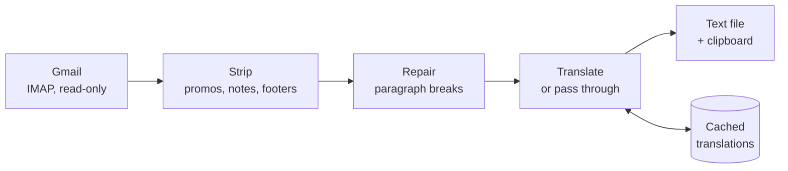

# Daily Grace

Fetches the **Daily Grace Inspiration** devotional email, strips it back to just
the devotional, translates it, and hands it to you as clean text — in a small
local web app, a terminal command, or a Claude Code slash command.

Built because reading a daily devotional in a second language meant copying it
out of Gmail by hand every morning, deleting the ads and footers, and pasting it
into a translator.



**No API keys. No paid services. No dependencies.** Every script is Python
standard library only — there is nothing to `pip install`.

## What it does

- **Pulls the last 7 days** of devotionals in one press, newest in the centre and
  the week listed down the side; click any day to read it.
- **Strips the newsletter furniture** — tracking links, book promotions,
  "Today's Offer", the pastor's sign-off note, the source-book credit,
  unsubscribe footer, and postal address.
- **Repairs the formatting.** These emails break paragraphs mid-sentence at bold
  spans, and separate paragraphs with a single newline rather than a blank line.
  Both are reconstructed (see [Design notes](#design-notes)).
- **Translates** to Russian by default, or any of eight other languages, with
  **English — original** to skip translation entirely.
- **Caches everything** as plain `.txt` files. Re-pressing is instant; tomorrow
  only tomorrow's devotional is translated.
- **Never modifies your mailbox.** IMAP is opened read-only, so nothing is
  marked read, moved, or deleted.

## Requirements

- Python 3.9+
- A Gmail account that receives the devotional
- A Google App Password (2-Step Verification must be on)

Optional: Claude Code, if you want the `/daily-grace` command and its better
translation quality.

## Setup

```bash
git clone https://github.com/RyanHan0127/daily-grace-translator.git
cd daily-grace-translator
./install.sh          # macOS/Linux
```

```powershell
powershell -ExecutionPolicy Bypass -File install.ps1   # Windows
```

Then create your credentials:

1. Enable 2-Step Verification — <https://myaccount.google.com/signinoptions/two-step-verification>
2. Create an App Password — <https://myaccount.google.com/apppasswords>
3. Copy `.env.example` to `.env` and fill in both values

An App Password is a single-purpose 16-character key. It is not your Google
password, it only grants mail access, and it can be revoked on its own at any
time. `.env` is gitignored and never leaves your machine.

macOS users: see [SETUP-MAC.md](SETUP-MAC.md) for a step-by-step walkthrough,
including the Gatekeeper warnings that trip up unsigned scripts.

## Usage

**Web app** — the main way to use it:

```bash
python3 app.py
```

Opens at `http://localhost:8765`. Also reachable at
`http://daily-grace.localhost:8765` in Chrome, Edge, Opera, Brave and Firefox
(not Safari, which defers to the system resolver).

**Terminal** — prints the devotional and copies it:

```bash
python3 daily_grace.py                 # Russian
python3 daily_grace.py -l Korean
python3 daily_grace.py -l English      # no translation, just cleaned
python3 daily_grace.py --fresh         # ignore the cache for today
```

**Claude Code** — slower, but noticeably better translation:

```
/daily-grace
/daily-grace spanish
```

Google Translate does not know that English *Psalm 103* is *Псалом 102* in the
Russian Synodal Bible, drifts between formal and informal address inside a
paragraph, and renders "devotional" as *молитва* (prayer). Claude gets these
right. All three entry points share one cache, so a day translated through
Claude Code becomes the web app's copy for that day.

## Project structure

| File | Role |
|---|---|
| `app.py` | Local web server. Loopback only; serves one page and one API route. |
| `index.html` | The interface. |
| `fetch_daily_grace.py` | IMAP fetch, MIME walking, HTML→text extraction. |
| `daily_grace.py` | Boilerplate stripping, paragraph repair, terminal entry point. |
| `translate.py` | Google Translate backends, language codes, chunking. |
| `store.py` | Where translations live, and the fingerprinted cache. |
| `deliver.py` | Cross-platform clipboard (Win32 API / pbcopy / xclip). |
| `install.sh`, `install.ps1` | Installers. |
| `command-template.md` | Source for the Claude Code slash command. |
| `translations/<lang>/<date>.txt` | Output. Gitignored. |

## Design notes

The interesting problems were not the fetching.

**The email's paragraphs are broken twice over.** Paragraphs are split
mid-sentence wherever a bold span starts — one lands directly after an opening
quotation mark (`the enemy is quick to whisper, "`). Elsewhere, real paragraph
breaks are marked with a single newline instead of a blank line, so naive
splitting collapses a whole devotional into one 2,600-character block. The
cleaner distinguishes the two: a line ending mid-sentence is a wrap and gets
joined, a line ending in terminal punctuation ends a paragraph. A trailing colon
counts as closing, so section headers do not swallow the paragraph beneath them.

**The HTML part is better than the plain-text part.** Measured across 30 days,
the HTML gave more paragraphs on 23 days and fewer on none. Extraction falls
back to plain text if the HTML ever yields a suspiciously short result.

**Structure is detected on the English, not the translation.** Every devotional
is scripture / reference / date / title / body, but that shape is only reliably
visible before translating — Russian runs longer than English, so
length-based detection mislabels the date as the title. Positions are found in
the source and applied to the translated blocks.

**The cache is keyed by a fingerprint of the cleaned English**, not by date
alone. An earlier version compared paragraph counts, which silently missed edits
*inside* a paragraph and served stale text after the stripping rules changed.

Verified against the last 60 devotionals: zero boilerplate leaks, structure
detected on all 60, zero unjoined fragments, no paragraph over 990 characters.

## Privacy

- Your App Password lives in `.env`, gitignored, and is sent only to Gmail.
- The mailbox is opened **read-only**.
- The web server binds to `127.0.0.1` — unreachable from your network — and
  whitelists exactly two routes, so `.env` cannot be served.
- Devotional text goes to Google Translate unless you select English.
- Fetched emails and translations are gitignored; this repository contains code
  only and redistributes none of the devotional content.

## Notes

The devotional is written and published by Joseph Prince Ministries. This is a
personal reading tool for mail you already subscribe to; it does not scrape,
rehost, or redistribute anything.
